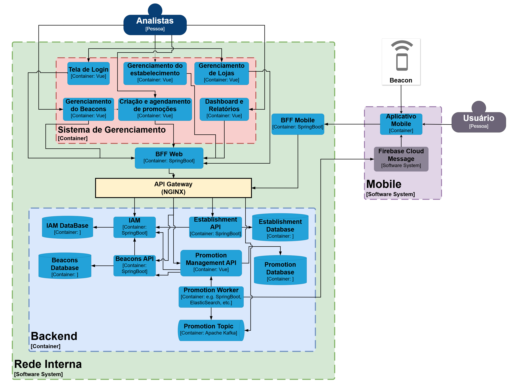

# Sobre esse projeto

Esse projeto, baseado em Java Spring Boot e outras tecnologias, é uma prova de conceito simplificada de um sistema de marketing de proximidade voltado para ambientes de comércio físico, como shoppings, galerias e supermercados com a finalidade de aumentar o engajamento do cliente e automatizar campanhas promocionais por meio de um aplicativo mobile com suporte à BLE (Bluetooth Low Energy) e um painel web administrativo.

> Bluetooth Low Energy (Bluetooth LE, colloquially BLE, formerly marketed as Bluetooth Smart) is a wireless personal area network technology designed and marketed by the Bluetooth Special Interest Group (Bluetooth SIG) aimed at novel applications in the healthcare, fitness, beacons, security, and home entertainment industries. Compared to Classic Bluetooth, Bluetooth Low Energy is intended to provide considerably reduced power consumption and cost while maintaining a similar communication range. (Extraído do artigo da Wikipedia sobre o assunto em [Bluetooth Low Energy](https://en.wikipedia.org/wiki/Bluetooth_Low_Energy))

## Objetivos

Os objetivos de um sistema de marketing de proximidade são:

1. Impulsionar o engajamento dos clientes com ofertas contextuais no ponto de venda
2. Fornecer autonomia para equipes de marketing criarem campanhas
3. Disponibilizar dados analíticos de proximidade para medir o desempenho das campanhas em tempo real

Já os objetivos desse projeto são mais singelos e ligados a aprendizado técnico:

1. Construir uma aplicação em Java, usando o framework SpringBoot;
2. Construir e conectar diferentes microsserviços;
3. Provisionar uma instância do Keycloak para autenticação e autorização
4. Uso de containers Docker para repetibilidade e simulação de um ambiente produtivo similar ao ambiente de desenvolvimento

## Visão geral do sistema

A Figura 1 apresenta a visão do geral do sistema. Nessa imagem beacon é um dispositivo montado em uma loja ou balção de corredor de um shopping ou galeria comercial, ou mesmo em uma loja de frente de rua. O usuário representado deve ter o aplicativo de cupons instalados em seu celular ou dispositivo móvel (smart watch ou tables) e registrado no estabelecimento que tem o beacon instalado fisicamente. Quando o beacon detecta a proximidade do dispositivo cadastrado, verifica as campanhas de marketing disponíveis e envia uma notificação para o dispositivo do usuário por meio do sistema, usando o protocolo HTTP. O papel do beacon nesse sistema é identificar qual dispositivo está nas proximidades para então disparar o processo de envio da campanha.

Figura 1: Visão conceitual do sistema de marketing de proximidade

O administrador, nessa representação, tem acesso a painéis onde pode gerenciar campanhas de marketing, inclusive agendando para períodos pré-determinados para aproveitar datas comemorativas ou disparar ofertas relâmpago com condições especiais para os usuários cadastrados. A interação do administrador com o sistema se dá por meio de uma interface web que se comunica com a aplicação.

## Componentes do sistema

## Sistema de gerenciamento

Os elementos do sistema de gerenciamento são:
- **Tela de login**: Tela na qual o usuário realiza o login para ter autorização a acessar o sistema.
- **Gerenciamento do estabelecimento**: Gerenciamento do estabelecimento (CRUD) contendo endereço, horário de funcionamento e administradores.
- **Gerenciamento de Lojas**: Gerenciamento de loja (CRUD), vinculada ao estabelecimento comercial, com dados de contato, setor de atuação e logo.
- **Gerenciamento do Beacons**: Gerenciamento do Beacons(CRUD) com registro de UUID, Major e Minor de cada beacon e associação a loja.
- **Criação e agendamento de promoções**: Criação e agendamento de promoções para lojas, deve conter as informações básicas, critérios de público alvo e data de ativação e desativação.
- **Dashboard e Relatórios**: Relatório de performace de promoções, taxa de abertura de notificações, conversão e exportação desses relatórios.

## Aplicativo mobile

## Backend

# Referências

1. [Bluetooth Low Energy](https://en.wikipedia.org/wiki/Bluetooth_Low_Energy)
